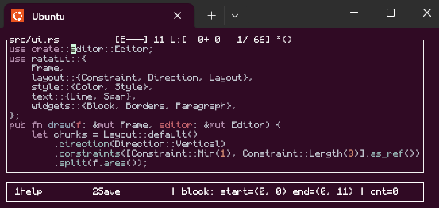

# rsted
Simple Rust CLI single text/source editor, to integrate with terminal muxer (eg: tmux) and Rust toolchain (eg: auto format, changes watch..).

Project goals:
- [x] Single file edition for simplicity
- [x] Syntax-highlighting
- [x] Automatic file change detection/reload (eg: parallel cargo fmt)
- [ ] Midnight Commander Editor (mcedit) look-and-feel (keys/menus) -- WIP

Ideas:
- [ ] Evaluate Language Server Protocol connection feasibility (??)
